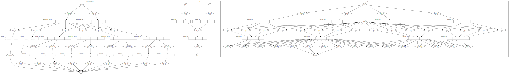

# simd_viz

cpp simd src to graphviz dot file

## support list
* arm neon
* ~~intel sse, avx~~

## TODO
* add support of pip install
* add support of non-neon variable
* 異なるスコープの同一の変数名に対して，同じ参照となる問題
* 同一スコープの同一の変数名に新規代入された場合に，同じ参照となる問題
* add test case

## examples
### code
```
#include "arm_neon.h"

void neon_example_1() {
  int16_t *src;
  int16_t *dst;
  int16x8_t src_lane_0 = vld1q_s16(src);
  int16x8_t src_lane_8 = vld1q_s16(src + 8);

  int16x8_t src_lane_1 = vextq_s16(src_lane_0, src_lane_8, 1);
  int16x8_t src_lane_2 = vextq_s16(src_lane_0, src_lane_8, 2);
  int16x8_t src_lane_3 = vextq_s16(src_lane_0, src_lane_8, 3);
  int16x8_t src_lane_4 = vextq_s16(src_lane_0, src_lane_8, 4);

  vst1_s16(dst + 0, vget_low_s16(src_lane_0));
  vst1_s16(dst + 4, vget_low_s16(src_lane_1));
  vst1_s16(dst + 8, vget_low_s16(src_lane_2));
  vst1_s16(dst + 12, vget_low_s16(src_lane_3));
  vst1_s16(dst + 16, vget_low_s16(src_lane_4));

  vst1_s16(dst + 20, vget_high_s16(src_lane_0));
  vst1_s16(dst + 24, vget_high_s16(src_lane_1));
  vst1_s16(dst + 28, vget_high_s16(src_lane_2));
  vst1_s16(dst + 32, vget_high_s16(src_lane_3));
  vst1_s16(dst + 36, vget_high_s16(src_lane_4));
}

void neon_example_2() {
  uint8_t a[8];  // d0
  uint8_t b[8];  // d1
  uint8_t c[8];  // result

  uint8x8_t va, vb, vc;
  va = vld1_u8(a);
  vb = vld1_u8(b);
  vc = vqadd_u8(va, vb);
  vst1_u8(c, vc);
}

void neon_example_3(float result[16], const float base[16],
                    const float mult[16]) {
  float32x4_t c0, c1, c2, c3;
  float32x4_t r0, r1, r2, r3;

  c0 = vld1q_f32(&mult[0]);
  c1 = vld1q_f32(&mult[4]);
  c2 = vld1q_f32(&mult[8]);
  c3 = vld1q_f32(&mult[12]);

  // column 0
  r0 = vmulq_n_f32(c0, base[0]);
  r1 = vmulq_n_f32(c1, base[1]);
  r2 = vmulq_n_f32(c2, base[2]);
  r3 = vmulq_n_f32(c3, base[3]);

  r0 = vaddq_f32(r0, r1);
  r2 = vaddq_f32(r2, r3);
  r0 = vaddq_f32(r0, r2);

  vst1q_f32(&result[0], r0);

  // column 1
  r0 = vmulq_n_f32(c0, base[4]);
  r1 = vmulq_n_f32(c1, base[5]);
  r2 = vmulq_n_f32(c2, base[6]);
  r3 = vmulq_n_f32(c3, base[7]);

  r0 = vaddq_f32(r0, r1);
  r2 = vaddq_f32(r2, r3);
  r0 = vaddq_f32(r0, r2);

  vst1q_f32(&result[4], r0);

  // column 2
  r0 = vmulq_n_f32(c0, base[8]);
  r1 = vmulq_n_f32(c1, base[9]);
  r2 = vmulq_n_f32(c2, base[10]);
  r3 = vmulq_n_f32(c3, base[11]);

  r0 = vaddq_f32(r0, r1);
  r2 = vaddq_f32(r2, r3);
  r0 = vaddq_f32(r0, r2);

  vst1q_f32(&result[8], r0);

  // column 3
  r0 = vmulq_n_f32(c0, base[12]);
  r1 = vmulq_n_f32(c1, base[13]);
  r2 = vmulq_n_f32(c2, base[14]);
  r3 = vmulq_n_f32(c3, base[15]);

  r0 = vaddq_f32(r0, r1);
  r2 = vaddq_f32(r2, r3);
  r0 = vaddq_f32(r0, r2);

  vst1q_f32(&result[12], r0);
}
```

### svg


----

## how to install
```
pip3 install graphviz

WIP
```

## hot to run
```
# Mac OS X
LD_LIBRARY_PATH="/usr/local/opt/llvm/lib:$LD_LIBRARY_PATH" ./simd_viz.py example.cpp -o example
# output is example.svg

# Ubuntu
LD_LIBRARY_PATH="/usr/lib/llvm-5.0/lib:$LD_LIBRARY_PATH" ./simd_viz.py example.cpp -o example
```

## how to see ast
```
clang-check example.cpp -ast-dump -ast-dump-filter=neon -- -c
```

## FYI
* [umaumax/gccparser]( https://github.com/umaumax/gccparser )
